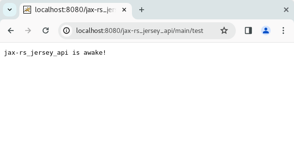

# JAX-RS Jersey - RESTful API

## Sobre
Esta *POC* demonstra uma API REST de acordo com as especificações ***JSR 311: JAX-RS*** e ***JSR 330: Dependency Injection*** utilizando, respectivamente, as implementações ***Jersey*** e ***HK2***.<br />
Especificações muito utilizadas no passado, ainda rodando hoje em dia em aplicações legadas, acabaram se tornando obsoletas com a popularização e adoção do **Spring**.<br />

## Como usar
Não há o Tomcat embedded como estamos acostumados a ver atualmente em projetos Spring Boot. Desta forma, é necessário baixar o Tomcat (ou outro servlet container) e, manualmente, gerar, fazer o deploy do *.war* e subir este servlet container ou utilizar uma IDE que faça esta tarefa (eclipse, por exemplo). Não cabe abordar aqui esta configuração.<br />
* Gere o .war da aplicação
* Faça o download e realize o deploy do .war em um servlet container e starte-o
* Após, teste a aplicação chamando a URL abaixo (confira a porta configurada):
```
http://localhost:8080/jax-rs_jersey_api/main/test
```

## Links
* [JSR 311: JAX-RS: The Java API for RESTful Web Services](https://jcp.org/en/jsr/detail?id=311)
* [JSR 330: Dependency Injection for Java](https://jcp.org/en/jsr/detail?id=330)
* [The Java API for RESTful Web Services (JAX-RS)](https://www.oracle.com/technical-resources/articles/java/jax-rs.html)
* [HK2 API Overview](https://javaee.github.io/hk2/api-overview.html)
* [HK2 API Introduction](https://javaee.github.io/hk2/introduction.html)
* [HK2 API Doc](https://javaee.github.io/hk2/apidocs/index.html)
* [Wikipedia, em inglês: Jakarta RESTful Web Services](https://en.wikipedia.org/wiki/Jakarta_RESTful_Web_Services)
* [Wikipedia, em inglês: Dependency Injection](https://en.wikipedia.org/wiki/Dependency_injection)
* [Afinal, o que é JAX-RS?](https://medium.com/@alexjosesilva/afinal-o-que-%C3%A9-jax-rs-f218b0d6f972)